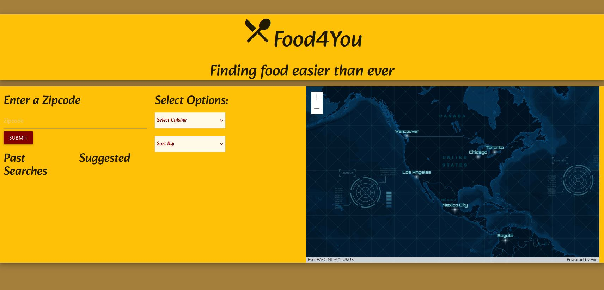

# Group-Project

## User Story

This application is being built for all those foodies out there looking to explore different options for some grub int their area. This app will let you input your zipcode and will find you recommendations based on your filters and criteria.

- Motivation for this was listening to people being tired of taking so long to look for a place to eat instea of a very simple way to fascilitate the process.
- We built this project mainly because our jobs as developers are to make life easier for people around us nad that is what makes it worth while, that this application will help foodies out there look for a place and be able to satisfy their cravingss while saving time.
- we learned from this project that using an API that has a map and that part was challenging and also the converting zipcode to actual latitude and longitude.

## Acceptance Criteria

When I enter the website
Then I will be asked to enter my location
When I type my zip code it will find the restaurants nearest to me
Then the restaurants will be sorted in a list
When I receive a list of restaurants
Then I will be able to filter by cost and cuisine
When I find a restaurant that I like
Then I will be able to choose or remove favorites
When I choose a favorite
Then it will be locally stored
When I come back to the website
Then I will see my search history of past restaurants

## Contributors
- Anurag Mishra
- Logan Linares
- William(AJ) Faries
- Victor Mora

## Framework
- www.https://materializecss.com

## API's to be used 
- https://rapidapi.com/apidojo/api/travel-advisor

- https://js.arcgis.com/4.26/esri

## Website 
https://victorjmora.github.io/Food-4-You/

